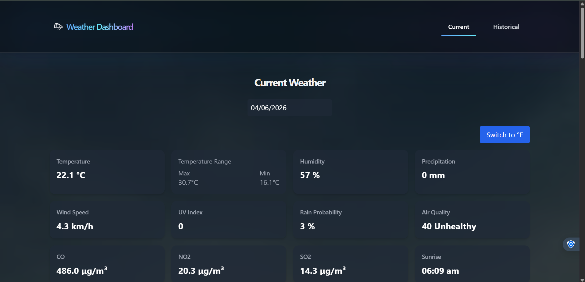
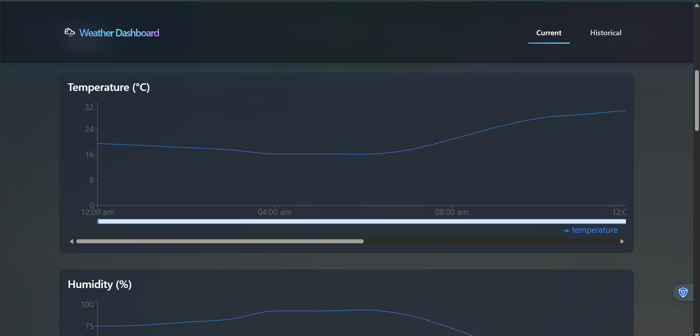
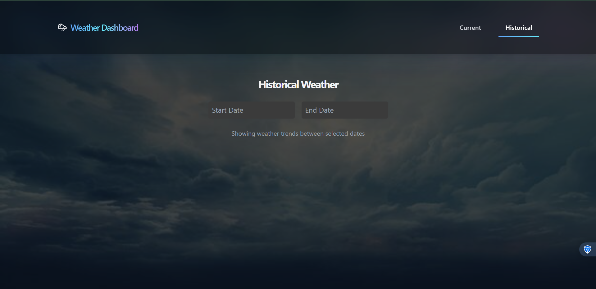
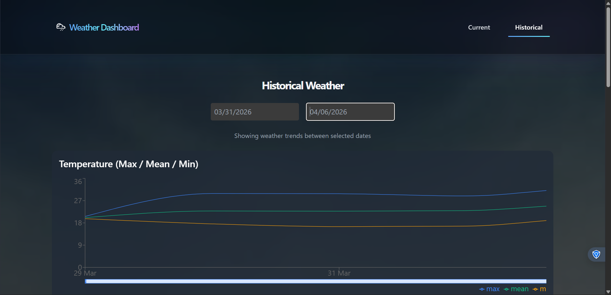

# 🌦 Weather Dashboard
  
---

## Screenshots

| Current Weather | Dashboard Insights |
|----------------|-------------------|
|  |  |

| Historical Trends | Advanced Analytics |
|------------------|-------------------|
|  |  |

---

## Overview

A responsive weather analytics dashboard built using ReactJS and Open-Meteo APIs.

The application automatically detects user location via browser GPS and provides real-time weather insights along with historical trend analysis (up to 2 years).

---

## Key Engineering Highlights

- Geolocation-based automatic weather detection  
- High-performance rendering (<500ms load time)  
- Interactive charts with zoom + horizontal scrolling  
- Hourly → daily aggregation for historical insights  
- Clean and scalable frontend architecture  
- Responsive glassmorphism UI design  
- Dynamic temperature unit toggle (°C ↔ °F)  
- Efficient API handling and state management  

---

## Core Features

### Current Weather

- Current, Min, Max Temperature  
- Relative Humidity & Precipitation  
- UV Index  
- Sunrise & Sunset  
- Wind Speed  
- Precipitation Probability  

---

### Air Quality

- AQI (PM2.5 based)  
- PM10 & PM2.5  
- CO, CO₂, NO₂, SO₂  

---

### Hourly Charts

- Temperature (°C / °F toggle)  
- Humidity  
- Precipitation  
- Visibility  
- Wind Speed (10m)  
- PM10 & PM2.5 (combined)  

Features:  
- Zoom functionality  
- Horizontal scrolling  
- Interactive tooltips  

---

### Historical Analytics (Max 2 Years)

- Temperature (Min / Mean / Max)  
- Total Precipitation  
- Wind Speed & Direction  
- Sunrise & Sunset (IST)  
- PM10 & PM2.5 trends  

---

## Visualization Features

- Horizontal scrolling for dense datasets  
- Zoom in/out for detailed analysis  
- Mobile-friendly adaptive charts  
- Smooth transitions and interactions  

---

## Setup

```bash
git clone https://github.com/Rachit753/weather-dashboard.git
cd weather-dashboard/frontend
npm install
npm run dev
```

---

## Deployment

**Live Demo:**  
https://weather-dashboard-tau-six.vercel.app/

---

## APIs Used

- Open-Meteo Weather API  
- Open-Meteo Air Quality API  

---

## Future Enhancements

- Animated weather backgrounds  
- Manual city search  
- Export charts (PNG/PDF)  
- Weather alerts  
- Multi-language support  

---

## Contribution

Open to feedback and improvements. Feel free to fork and contribute!

---

## Contact

**Rachit**

- GitHub: https://github.com/Rachit753  
- LinkedIn: https://www.linkedin.com/in/rachit-chauhan/  

---

## Support

If you found this project useful, consider giving it a ⭐.